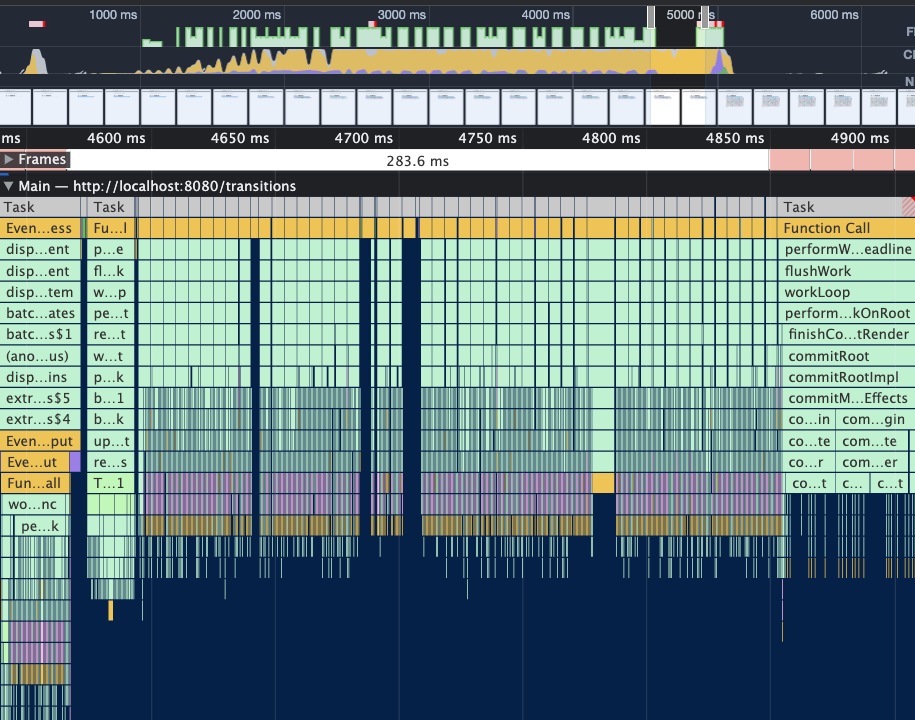
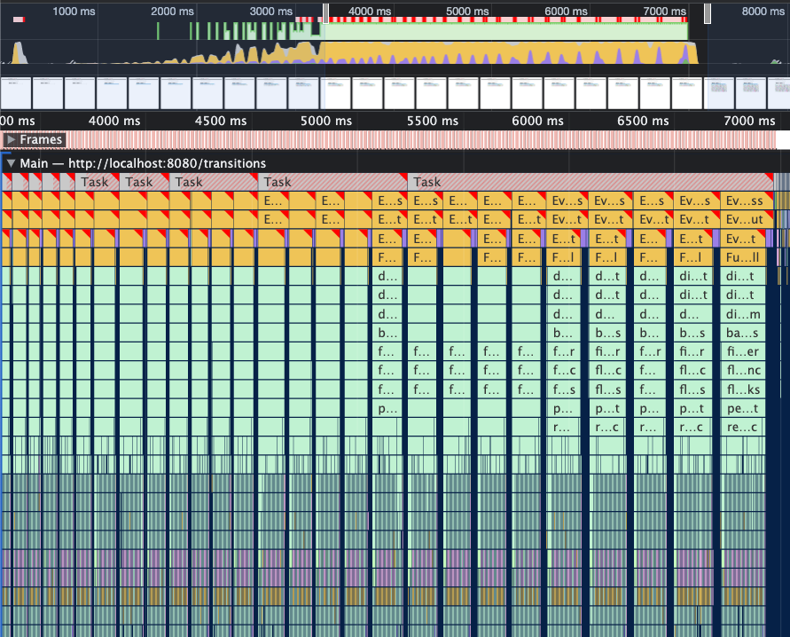

# Initialize React 18 기능 체험용 프로젝트

React 18이 정식으로 Release 되었고 많은 기능들이 소개되었습니다.

그 기능들을 직접 비교 체험해보면서 느껴보려고 합니다.

새로운 릴리즈이기 때문에 제일 잘 이뤄질 것 같은 webpack + babel로 번들링을 구성해서 테스트해보겠습니다.

> React Concurrency 개념을 이해하기 위해 다음 링크를 이용하시길 강력하게 추천드립니다.
> [Inside React - 동시성을 구현하는 기술](https://deview.kr/2021/sessions/518)  
> [발표자료](<https://deview.kr/data/deview/session/attach/1_Inside%20React%20(%E1%84%83%E1%85%A9%E1%86%BC%E1%84%89%E1%85%B5%E1%84%89%E1%85%A5%E1%86%BC%E1%84%8B%E1%85%B3%E1%86%AF%20%E1%84%80%E1%85%AE%E1%84%92%E1%85%A7%E1%86%AB%E1%84%92%E1%85%A1%E1%84%82%E1%85%B3%E1%86%AB%20%E1%84%80%E1%85%B5%E1%84%89%E1%85%AE%E1%86%AF).pdf>)

## new features

React 18 변화를 한 단어로 정리하자면 Concurrency 입니다.
대부분의 새로운 기능은 React에서 동시성을 제공하기 위한 기능입니다.

- [automatic batching](#automatic-batching)
- [transitions](#transitions)

## automatic batching

Batching은 React가 다수의 state를 가지고 있을 때 더 나은 성능을 위해 single re-render하도록 업데이트하는 것입니다.

promises, setTimeout, native event handlers, React에서 batch되지 않던 event들의 경우에 기존에는 각 state가 변경될 때마다 re-render가 일어났다면, react 18에서는 automatic batching으로 인해 `Batching`하여 자동으로 한 번만 re-render하도록 되었습니다.

```jsx
// Before: only React events were batched.
setTimeout(() => {
  setCount((c) => c + 1);
  setFlag((f) => !f);
  // React will render twice, once for each state update (no batching)
}, 1000);

// After: updates inside of timeouts, promises,
// native event handlers or any other event are batched.`
setTimeout(() => {
  setCount((c) => c + 1);
  setFlag((f) => !f);
  // React will only re-render once at the end (that's batching!)
}, 1000);
```

## transitions


- Urgent updates(긴급한 업데이트)은 타이핑, 클릭, 키입력과 같은 것들 바로 반응해야 하는 것들을 반영합니다.
- Transition updates(트랜지션 업데이트)은 하나의 view에서 또 다른 view로 UI를 전환합니다.

타이핑, 클릭, 키입력과 같은 Urgent Update는 물리적 객체가 어떻게 동작하는지에 대한 우리의 직관과 일치하도록 즉각적인 응답이 필요합니다. 그렇게 움직이지 않는다면 "잘못된" 느낌을 받습니다.
그러나 트랜지션은 사용자가 스크린에 트랜지션 중간의 모든 값을 볼 것으로 기대하지 않기 때문에 urgent update와 다릅니다.

예를 들어 dropdown에서 filter를 선택했을 때, filter 버튼이 당신이 클릭했을 때 즉각적으로 응답하길 기대할 것입니다. 그러나 실제 결과는 별도로 각각 전환될 수 있습니다. 약간의 딜레이는 감지할 수 없고 종종 예상됩니다. 그리고 만약 그 결과를 렌더링을 완료하기 전에 filter를 다시 바꾼다면 최신 결과만 볼 수 있습니다.

일반적으로 최상의 사용자 경험을 위해서는 단일 user input은 urgent update와 non-urgent update 모두 발생해야 합니다. input event 내에 startTransition API를 사용하면 어떤 update가 urgent한지, 어떤 것이 "transition"인지 React에게 알려줄 수 있습니다.

|        |
| :------------------------------: |
| **with transition** : concurrent |

|  |
| :------------------------------: |
| **without transition** : blocked |

transition을 사용했던 위 사진에서는 task가 잘게 쪼개져서 concurrent 하게 동작되는 것을 볼 수 있습니다.
그러나 transition이 없는 아래 사진은 long task가 block된 모습을 볼 수 있습니다. input에 타이핑을 하더라도 block으로 인해 화면에 렌더링되지 않은 이유입니다.

```jsx
import { startTransition } from 'react';

const handleInput = () => {
  // Urgent: Show what was typed
  setInputValue(input);

  // Mark any state updates inside as transitions
  startTransition(() => {
    // Transition: Show the results
    setSearchQuery(input);
  });
};
```

startTransition으로 감싸진 Update(setState)는 non-urgent(급하지 않은 것)으로 다뤄집니다.
만약 click이나 키입력과 같은 더 urgent(긴급한) 업데이트가 있다면 _interrupt_ 됩니다.

만약 사용자가 transition을 중단하면(예를 들어, 여러 문자를 연속으로 입력), React는 완료되지 않은 오래된 rendering 작업을 throw out(버림)하고 최신 업데이트만 렌더링합니다.
다시 말해, 다수의 글자를 입력할 때 렌더링을 기다렸던 중간 상태들은 버려지고 마지막 상태만 렌더링합니다.

- `useTransition`: transition을 시작하기 위한 pending 상태를 포함한 hook
- `startTransition`: hook이 사용되지 않을 때 transition을 시작하기 위한 method

transition은 concurrent rendering에서 해당 update를 중단할 수 있습니다. content가 re-suspend 상태가 된다면, transition은 백그라운드에서 trantition content를 렌더링하는 동안 현재 content를 계속 보여주도록 React에게 말합니다.

> Note:  
> transition에서 update는 클릭과 같은 보다 긴급한(urgent) update를 위해 중단합니다.  
> transition에서 update는 re-suspend된 content를 위해 fallback를 보여주지 않습니다.  
> update가 렌더링되는 동안에 사용자에게 현재 content와 계속해서 상호작용하도록 해줍니다.

기존에 렌더링 block이 한 묶음으로 이루어져 무거운 렌더링이 있을 경우 동시성 보장이 힘들었다면, useTransition을 통해 작업을 나누고 우선순위를 두어 동시성 문제를 해결합니다.

정리하자면 input에 값을 입력하는 것과 같은 urgent update는 즉각적으로 반응을 해야합니다.
그런데 heavy한 render로 인해 urgent update가 prevent 되는 경우가 발생한다면 이것은 UX에 안 좋은 영향을 줍니다. useTransition은 이러한 경우를 막기 위해 사용됩니다. non-urgent update를 startTransition으로 감싼다면 react는 '이것은 non-urgent update구나'라고 이해하고 render를 urgnet update보다 후순위로 미룹니다. 그래서 사람의 인지와 관련있는 urgent update를 더 빠르게 렌더링하여 더 나은 UX를 제공합니다.

### useTransition vs useDeferredValue

> react 18에서 공개된 useDeferredValue 라는 hook이 있습니다.  
> 동시성을 제공하기 위해서 사용되기에 useTransition과 얼핏 비슷해보이기도 합니다.  
> 저 또한 차이가 어떤 점에서 발생하는지 느낌으로만 알고 있는데 자세히 보기 위해 조금 살펴보았습니다.

useTransition은 위에도 살펴보았듯이 React에게 우선순위가 낮은 update를 알려주어 해당 non-urgent update를 urgent update 뒤로 rebase하게 해주는 역할을 합니다.

또한 useTransition은 어떤 코드를 낮은 우선순위로 다룰지, 어떤 코드를 wrapping할지 결정하도록 모든 권한을 줍니다.

```jsx
function App() {
  const [isPending, startTransition] = useTransition();
  const [filterTerm, setFilterTerm] = useState('');

  const filteredProducts = filterProducts(filterTerm);

  function updateFilterHandler(event) {
    startTransition(() => {
      setFilterTerm(event.target.value);
    });
  }

  return (
    <div id="app">
      <input type="text" onChange={updateFilterHandler} />
      {isPending && <p>Updating List...</p>}
      <ProductList products={filteredProducts} />
    </div>
  );
}
```

그러나 코드를 업데이트하는 실제 상태에 접근하지 못하는 경우가 있을 수 있습니다(예를 들어 third-party library에서 수행되는 경우 등). 또는 몇가지 이유로 인해 useTransition을 사용 못하게 될 수도 있습니다.

대신 그런 경우에 useDeferredValue를 사용할 수 있습니다.

useDeferredValue는 상태를 wrapping 하지 않습니다. 대신에 상태 업데이트 때문에 변경되거나 재생성된 value를 다룹니다(그 상태 그대로 쓰거나 또는 기본 상태에 computed 값).

```jsx
function ProductList({ products }) {
  const deferredProducts = useDeferredValue(products);
  return (
    <ul>
      {deferredProducts.map((product) => (
        <li>{product}</li>
      ))}
    </ul>
  );
}
```

**그래서 우리는 무엇을 써야합니까?**  
위에서 업급했듯이 useTransition은 상태 업데이트 코드를 wrapping하는 반면 useDeferredValue는 상태 업데이트의 영향을 받는 값(상태 그대로의 값 또는 상태에서 computed된 값)을 쓴다는 점입니다.

결국 둘 다 같은 목표를 달성하기 때문에 함께 사용할 필요는 없습니다.

더 낮은 우선순위로 처리해야 하는 상태 업데이트가 있고 상태 업데이트 코드에 접근할 수 있는 경우 useTransition을 사용하는 것이 더 좋습니다.
해당 코드에 접근 권한이 없다면 useDeferredValue를 사용하세요.

**반드시 써야할까요?**  
**모든** 상태 업데이트를 useTransition이나 useDeferredValue로 wrapping하지 마세요.
다른 수단으로 최적화할 수 없는 복잡한 UI나 component가 있을 때 이러한 hook을 사용해야 합니다.
lazy loading 사용, pagination 사용, worker thread에서 처리하는 것, backend 서버에서 처리하는 것 등으로 처리할 수 있는지를 항상 염두해 두어야 합니다.

## Suspense

Suspense는 아직 화면에 보여줄 준비가 되지 않은 경우에 component 트리의 일부에 대한 loading 상태를 선언적으로 지정할 수 있습니다.

```jsx
<Suspense fallback={<Spinner />}>
  <Comments />
</Suspense>
```

Suspense는 React 프로그래밍 모델에서 "UI loading 상태"를 first-class 선언적 개념으로 만듭니다.
(즉, `<Component>...</Component>` 형태로 쓸 수 있다는 말입니다.)

> fisrt-class(일급객체)  
> 다른 객체들에 일반적으로 적용 가능한 연산을 모두 지원하는 객체를 말합니다. 보통 함수에 인자로 넘기기, 수정하기, 변수에 대입하기와 같은 연산을 지원할 때 일급 객체라고 합니다.  
> 쉽게 말하면, 자바스크립트에서는 함수가 일급객체입니다. 리액트 선언적 개념으로 다루면 `<Component>` 형태로 쓸 수 있습니다.(`React.createElement(...)`와 동일하며 이 표현식은 명령형 개념입니다.)

이를 통해 더 높은 수준의 기능을 구축할 수 있습니다.

몇 년 전에 제한된 버전의 Suspense를 도입했습니다. 그러나 유일한 사용 사례는 React.lazy 코드 스플리팅에 사용된 경우였습니다. 서버에서 렌더링할 때는 전혀 지원되지 않았습니다.

React 18에서는 서버에서 Suspense에 대한 지원을 추가하고 Concurrent rendering 기능을 사용하여 기능을 확장했습니다.

Suspense는 transition API(useTransition, startTransition)와 함께 동작합니다.
transition하는 동안에 suspend(일시중지) 된다면 React는 이미 보이는(already-visible) 컨텐츠가 fallback으로 대체되는 것을 방지합니다. 대신 React는 잘못된 loading 상태를 막기 위해 data가 충분히 로드될 때까지 렌더링을 지연합니다.
